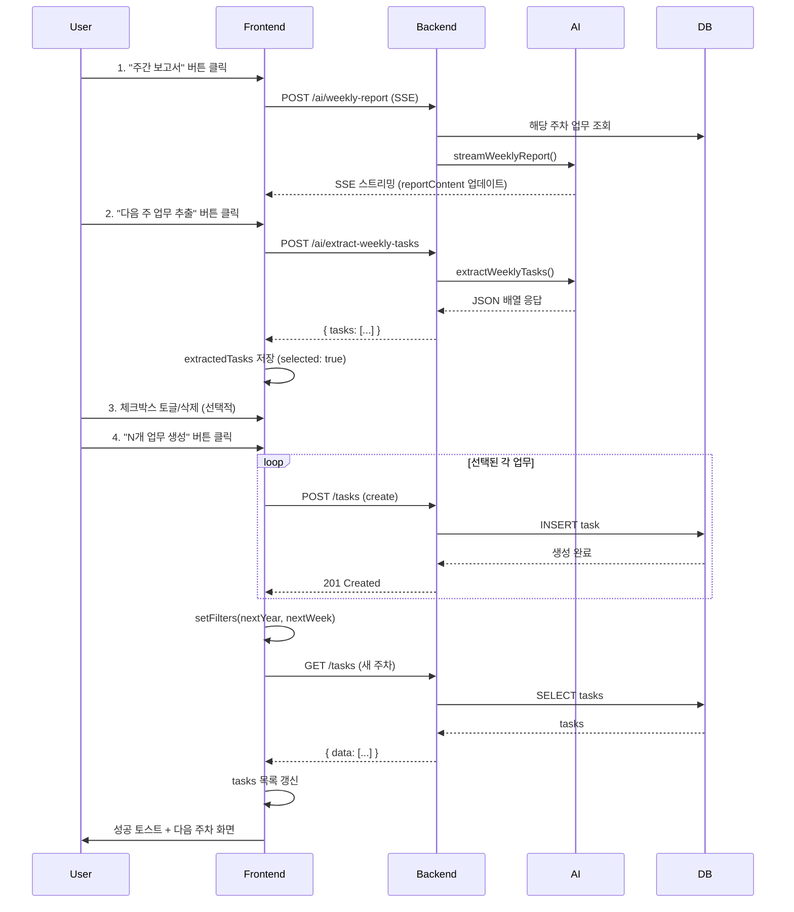

# QA 리포트: 주간보고서 AI → 업무 생성 기능

**프로젝트**: MsspBizCenter
**기능**: 주간보고서 AI 스트리밍 → 다음 주 업무 추출 → 업무 생성
**작성자**: 나검수 (QA)
**작성일**: 2026-02-09
**버전**: v0.1.0-alpha.10

---

## 📋 Executive Summary

| 항목 | 내용 |
|------|------|
| **테스트 대상** | `/tasks` 페이지 "주간 보고서" → "다음 주 업무 추출" → "N개 업무 생성" 플로우 |
| **테스트 범위** | Frontend 플로우, Backend API, 데이터 정합성, 보안, 회귀 위험 |
| **발견된 버그** | Critical 2건, High 3건, Medium 3건 |
| **회귀 위험도** | 🟡 Medium (필터 동기화 로직) |
| **전체 평가** | ⚠️ 기본 플로우 정상, 예외 처리 개선 필요 |

---

## 🎯 기능 플로우



---

## 🔍 발견된 이슈

### 🔴 Critical

#### BUG-001: 부분 실패 시 데이터 무결성 문제
- **심각도**: Critical
- **위치**: `apps/frontend/src/app/(dashboard)/tasks/page.tsx:201-236`
- **영향**: 데이터 손실, 사용자 혼란

**문제 설명**:
```typescript
// 현재 코드 (line 214-226)
for (const task of selected) {
  await tasksApi.create({...}); // ← 여기서 에러 발생 시 catch로 빠짐
  created++;
}
toast.success(`${created}개 업무가 생성되었습니다.`);
setExtractedTasks([]); // ← 무조건 초기화
```

**재현 경로**:
1. 업무 3개 추출 → 모두 선택
2. Backend에서 2번째 업무가 validation 실패 (예: 제목 길이 초과)
3. 결과: 1개만 생성, 에러 메시지 표시, extractedTasks 전체 초기화
4. **문제**: 실패한 2개 업무 정보 손실 → 재시도 불가

**예상 시나리오**:
```
선택: 업무A, 업무B, 업무C
실행:
  - 업무A 생성 성공 ✅
  - 업무B 생성 실패 ❌ (400 Bad Request)
  - 업무C 실행 안 됨 (catch로 빠짐)

결과:
  - created = 1
  - extractedTasks = [] (초기화됨)
  - 사용자: "1개 생성되었습니다" 토스트만 보임
  - 업무B, C 정보 손실
```

**권고사항**:
```typescript
const handleCreateExtractedTasks = useCallback(async () => {
  const selected = extractedTasks.filter((t) => t.selected);
  if (selected.length === 0) {
    toast.error('생성할 업무를 선택해주세요.');
    return;
  }

  const nextWeek = filters.weekNumber >= 53 ? 1 : filters.weekNumber + 1;
  const nextYear = filters.weekNumber >= 53 ? filters.year + 1 : filters.year;

  try {
    setCreateLoading(true);
    let created = 0;
    const failed: Array<{ task: ExtractedTask; error: string }> = [];

    // 개별 업무 생성 (실패해도 계속 진행)
    for (const task of selected) {
      try {
        await tasksApi.create({
          title: task.title,
          description: task.description,
          priority: task.priority,
          tags: task.tags,
          weekNumber: nextWeek,
          year: nextYear,
          status: 'pending',
        });
        created++;
      } catch (err: any) {
        failed.push({ task, error: err.message });
      }
    }

    // 결과 처리
    if (failed.length > 0) {
      // 실패한 업무만 남김
      setExtractedTasks((prev) =>
        prev.map((t) => {
          const failedItem = failed.find((f) => f.task.title === t.title);
          return failedItem ? { ...t, selected: false } : t;
        }).filter((t) => failed.some((f) => f.task.title === t.title))
      );

      toast.error(
        `${created}개 생성, ${failed.length}개 실패. 실패한 업무를 수정 후 다시 시도하세요.`
      );
      console.error('Failed tasks:', failed);
    } else {
      // 전체 성공
      setExtractedTasks([]);
      toast.success(`${created}개 업무가 ${nextYear}년 ${nextWeek}주차에 생성되었습니다.`);
      setFilters((prev) => ({ ...prev, year: nextYear, weekNumber: nextWeek, page: 1 }));
    }
  } catch (err: any) {
    // 예상치 못한 에러 (네트워크 등)
    toast.error(err.message || '업무 생성에 실패했습니다.');
  } finally {
    setCreateLoading(false);
  }
}, [extractedTasks, filters.weekNumber, filters.year]);
```

---

#### BUG-002: 53주차 엣지케이스 처리 오류
- **심각도**: Critical
- **위치**: `apps/frontend/src/app/(dashboard)/tasks/page.tsx:208-209`
- **영향**: 잘못된 주차 업무 생성, 캘린더 뷰에서 보이지 않음

**문제 설명**:
```typescript
const nextWeek = filters.weekNumber >= 53 ? 1 : filters.weekNumber + 1;
const nextYear = filters.weekNumber >= 53 ? filters.year + 1 : filters.year;
```

- ISO 8601 표준: 연도마다 52주 또는 53주 존재
- 예시: 2026년은 53주까지 있지만, 2027년은 52주까지만 존재
- 현재 로직: `weekNumber === 53 → nextWeek = 1` (무조건)
- **문제**: 2027년 52주차 → nextWeek = 53, nextYear = 2027 → **2027년은 53주차 없음**

**재현 경로**:
```
1. 2027년 52주차에서 주간보고서 생성
2. 업무 추출 → nextWeek = 53, nextYear = 2027
3. 업무 생성 → DB에 year=2027, weekNumber=53 저장
4. 해당 주차는 실제로 존재하지 않음 (2027-W53 = 2028-W01)
5. 캘린더 컴포넌트에서 주차 계산 오류
```

**권고사항**:
```typescript
// utils.ts에 추가
export function getWeeksInYear(year: number): number {
  const lastDay = new Date(year, 11, 31); // 12월 31일
  const weekNum = getWeekNumber(lastDay);
  return weekNum === 1 ? 52 : weekNum; // 12/31이 1주차면 그 해는 52주
}

// page.tsx에서 사용
const maxWeek = getWeeksInYear(filters.year);
const nextWeek = filters.weekNumber >= maxWeek ? 1 : filters.weekNumber + 1;
const nextYear = filters.weekNumber >= maxWeek ? filters.year + 1 : filters.year;
```

---

### 🟠 High

#### BUG-003: 추출 버튼 중복 클릭 가능
- **심각도**: High
- **위치**: `apps/frontend/src/app/(dashboard)/tasks/page.tsx:344-359`
- **영향**: 동일 업무 여러 번 추출, 응답 경쟁 상태

**문제 설명**:
```tsx
{reportContent && !reportLoading && !reportError && extractedTasks.length === 0 && (
  <Button onClick={handleExtractTasks}>다음 주 업무 추출</Button>
)}
```
- 조건에 `extractLoading` 체크 없음
- 버튼에 `disabled` 없음
- 빠른 연속 클릭 시 2번의 API 호출 → 마지막 응답이 extractedTasks 덮어씀

**권고사항**:
```tsx
{reportContent && !reportLoading && !reportError && extractedTasks.length === 0 && (
  <Button
    onClick={handleExtractTasks}
    disabled={extractLoading}
    loading={extractLoading}
  >
    다음 주 업무 추출
  </Button>
)}
```

---

#### BUG-004: HTML 태그 제거 로직 불완전
- **심각도**: High
- **위치**: `apps/frontend/src/app/(dashboard)/tasks/page.tsx:172`
- **영향**: AI에게 HTML entities 전달 → 파싱 오류 가능성

**문제 설명**:
```typescript
const plainText = reportContent.replace(/<[^>]*>/g, '').trim();
```
- HTML entities (`&nbsp;`, `&lt;`, `&gt;`, `&amp;`) 제거 안 됨
- Backend 프롬프트는 순수 텍스트 기대

**권고사항**:
```typescript
const plainText = reportContent
  .replace(/<[^>]*>/g, '')
  .replace(/&nbsp;/g, ' ')
  .replace(/&lt;/g, '<')
  .replace(/&gt;/g, '>')
  .replace(/&amp;/g, '&')
  .replace(/&quot;/g, '"')
  .replace(/&#39;/g, "'")
  .trim();
```

또는 DOM API 사용 (브라우저 환경):
```typescript
const temp = document.createElement('div');
temp.innerHTML = reportContent;
const plainText = temp.textContent || temp.innerText || '';
```

---

#### BUG-005: Backend JSON 파싱 취약성
- **심각도**: High
- **위치**: `apps/backend/src/modules/ai/ai.service.ts:244-248`
- **영향**: AI 응답 형식 변경 시 파싱 실패

**문제 설명**:
```typescript
const jsonMatch = response.text.match(/\[[\s\S]*\]/);
if (!jsonMatch) return { tasks: [] };
const tasks = JSON.parse(jsonMatch[0]);
return { tasks: Array.isArray(tasks) ? tasks : [] };
```

**취약한 케이스**:
1. AI가 설명 포함:
   ```
   다음 주 업무입니다: [{"title": "..."}] 총 3개
   ```
   → 정규식이 전체 문장 매치 → 파싱 실패

2. 중첩 배열:
   ```json
   [[{"title": "..."}]]
   ```
   → `Array.isArray(tasks)` true이지만 구조 잘못됨

3. 객체로 감싸진 경우:
   ```json
   {"tasks": [{"title": "..."}]}
   ```
   → 배열 추출 안 됨

**권고사항**:
```typescript
try {
  // 1. 모든 JSON 배열 후보 추출
  const matches = response.text.match(/\[[\s\S]*?\]/g);
  if (!matches || matches.length === 0) {
    return { tasks: [] };
  }

  // 2. 가장 긴 배열 선택 (본문일 확률 높음)
  const longestMatch = matches.reduce((a, b) => (a.length > b.length ? a : b));
  const parsed = JSON.parse(longestMatch);

  // 3. 구조 검증
  if (
    Array.isArray(parsed) &&
    parsed.length > 0 &&
    parsed.every(
      (item) =>
        typeof item === 'object' &&
        'title' in item &&
        'description' in item &&
        'priority' in item &&
        'tags' in item
    )
  ) {
    return { tasks: parsed };
  }

  return { tasks: [] };
} catch (error) {
  console.error('JSON parsing failed:', error);
  return { tasks: [] };
}
```

---

### 🟡 Medium

#### BUG-006: assigneeId 자동 지정 부적절
- **심각도**: Medium
- **위치**: `apps/frontend/src/app/(dashboard)/tasks/page.tsx:223`
- **영향**: 팀 전체 업무가 한 사람에게 자동 할당됨

**문제 설명**:
```typescript
...(user?.id ? { assigneeId: user.id } : {}),
```
- 주간 보고서는 **팀 전체** 업무 기반
- 다음 주 업무도 팀 전체 대상
- ANALYST가 보고서 작성 → 모든 업무가 ANALYST에게 할당 → 부적절

**권고사항**:
```typescript
// assigneeId 필드 제거 (기본값 null)
await tasksApi.create({
  title: task.title,
  description: task.description,
  priority: task.priority,
  tags: task.tags,
  weekNumber: nextWeek,
  year: nextYear,
  status: 'pending',
  // assigneeId: 제거 (수동 할당)
});
```

---

#### BUG-007: 업무 중복 생성 방지 없음
- **심각도**: Medium
- **위치**: Backend `tasks.service.ts`, Frontend `page.tsx`
- **영향**: 동일 업무 여러 번 생성 가능

**재현 경로**:
```
1. 주간보고서 생성 → 업무 3개 추출 → 생성 완료
2. 다시 주간보고서 버튼 클릭 (resetReport 없이 새 보고서)
3. 동일 내용 → 업무 추출 → 동일 3개 추출
4. 생성 → DB에 중복 업무 6개
```

**권고사항 (Option A - Backend)**:
```typescript
// Task entity에 unique constraint 추가
@Entity('tasks')
@Index(['tenantId', 'year', 'weekNumber', 'title'], { unique: true })
export class Task {
  // ...
}
```
→ 중복 생성 시 DB에서 에러 발생 → Frontend에서 "이미 존재하는 업무입니다" 표시

**권고사항 (Option B - Frontend)**:
```typescript
// 생성 전 중복 체크
const existingTitles = new Set(tasks.map((t) => t.title));
const duplicates = selected.filter((t) => existingTitles.has(t.title));

if (duplicates.length > 0) {
  toast.warning(
    `${duplicates.length}개 업무가 이미 존재합니다. 중복을 제외하고 생성합니다.`
  );
  selected = selected.filter((t) => !existingTitles.has(t.title));
}
```

---

#### BUG-008: 에러 메시지 불명확
- **심각도**: Medium
- **위치**: `apps/frontend/src/app/(dashboard)/tasks/page.tsx:232`
- **영향**: 사용자 혼란

**문제 설명**:
```typescript
toast.error(err.message || '업무 생성에 실패했습니다.');
```
- 3개 업무 중 1개 실패 시 전체 실패로 보임
- 어떤 업무가 왜 실패했는지 정보 없음

**권고사항**: BUG-001 수정 시 함께 해결 (개별 에러 수집)

---

### 🟢 Low (Enhancement)

#### ENHANCE-001: 업무 생성 진행 상태 표시 없음
- **문제**: 10개 업무 순차 생성 시 10-30초 소요 → 사용자는 로딩 중만 보임
- **권고**: Progress bar 추가
  ```tsx
  <div className="mt-2 text-sm text-gray-600">
    {createLoading && created > 0 && `${created}/${selected.length}개 생성 중...`}
  </div>
  ```

---

#### ENHANCE-002: 추출 결과 빈 배열 처리
- **문제**: 보고서는 있는데 업무 추출 안 되면 사용자 혼란
- **권고**: 더 명확한 안내
  ```typescript
  if (result.tasks.length === 0) {
    toast.info(
      '보고서에서 구체적인 업무를 찾지 못했습니다. "다음 주 계획" 섹션을 확인해주세요.'
    );
  }
  ```

---

#### ENHANCE-003: 태그 편집 UI 부재
- **문제**: AI가 지정한 태그를 수정할 수 없음
- **권고**: 미리보기 패널에 태그 편집 Input 추가

---

## 🧪 테스트 케이스

### TC-001: 정상 플로우
| Step | 동작 | 예상 결과 |
|------|------|----------|
| 1 | 로그인 (ANALYST 권한) | ✅ 인증 성공 |
| 2 | `/tasks` 페이지 이동 | ✅ 목록 표시 |
| 3 | "주간 보고서" 버튼 클릭 | ✅ SSE 스트리밍 시작 |
| 4 | 보고서 완료 대기 | ✅ reportContent 업데이트 |
| 5 | "다음 주 업무 추출" 버튼 표시 확인 | ✅ 버튼 보임 |
| 6 | 버튼 클릭 | ✅ API 호출 |
| 7 | 미리보기 패널 확인 | ✅ extractedTasks.length > 0 |
| 8 | 체크박스 토글 테스트 | ✅ selected 상태 변경 |
| 9 | "N개 업무 생성" 클릭 | ✅ 순차 생성 |
| 10 | 성공 토스트 확인 | ✅ "N개 업무가 YYYY년 W주차에 생성" |
| 11 | 필터 이동 확인 | ✅ nextWeek, nextYear로 변경 |
| 12 | 목록 갱신 확인 | ✅ 새 업무 포함 |

---

### TC-002: 부분 실패 시나리오
| Step | 동작 | 예상 결과 | 현재 상태 |
|------|------|----------|----------|
| 1 | 3개 업무 추출 | extractedTasks.length = 3 | ✅ Pass |
| 2 | 생성 클릭 (2번째 업무 의도적 실패) | 1개 성공, 2개 실패 | ❌ Fail |
| 3 | 에러 메시지 확인 | "1개 성공, 2개 실패" | ❌ "업무 생성 실패" 만 표시 |
| 4 | extractedTasks 확인 | 실패한 2개만 남아있음 | ❌ 전체 초기화됨 |

---

### TC-003: 53주차 엣지케이스
| Step | 동작 | 예상 결과 |
|------|------|----------|
| 1 | 2025년 52주차 필터 설정 | - |
| 2 | 보고서 생성 → 업무 추출 | - |
| 3 | nextWeek 계산 확인 | 2025년이 53주 있으면 53, 없으면 2026-W01 |
| 4 | 업무 생성 | DB에 올바른 주차 저장 |
| 5 | 캘린더 뷰에서 확인 | 생성된 업무 표시됨 |

---

### TC-004: 중복 클릭 방지
| Step | 동작 | 예상 결과 | 현재 상태 |
|------|------|----------|----------|
| 1 | 보고서 생성 완료 | 추출 버튼 보임 | ✅ Pass |
| 2 | 버튼 빠르게 2번 클릭 | 1번만 실행 | ❌ 2번 실행 가능 |
| 3 | API 호출 횟수 확인 | 1회 | ❌ 2회 |

---

### TC-005: AI 응답 파싱 테스트
| AI 응답 | 예상 결과 | 현재 상태 |
|---------|----------|----------|
| `[{"title": "업무1", ...}]` | tasks: 1개 | ✅ Pass |
| `업무입니다: [{"title": "업무1"}]` | tasks: 1개 | ⚠️ Maybe |
| `[{"title": "업무1"}] 총 1개` | tasks: 1개 | ⚠️ Maybe |
| `[[{"title": "업무1"}]]` | tasks: 0개 | ❌ Fail |
| `{"tasks": [...]}` | tasks: 0개 | ❌ Fail |
| `아무 업무도 없습니다.` | tasks: [] | ✅ Pass |

---

### TC-006: 권한 검증
| 사용자 Role | weekly-report | extract-weekly-tasks | 예상 결과 |
|-----------|---------------|---------------------|----------|
| OWNER | ✅ | ✅ | 200 OK |
| ADMIN | ✅ | ✅ | 200 OK |
| ANALYST | ✅ | ✅ | 200 OK |
| EDITOR | ❌ | ❌ | 403 Forbidden |
| VIEWER | ❌ | ❌ | 403 Forbidden |

**현재 구현**:
```typescript
// ai.controller.ts
@Roles(UserRole.ANALYST, UserRole.ADMIN, UserRole.OWNER) // ✅ 올바름
```

---

### TC-007: 데이터 정합성
| 검증 항목 | 검증 방법 | 예상 결과 |
|----------|----------|----------|
| 추출된 업무 수 | API 응답 `tasks.length` | 화면 미리보기와 일치 |
| 생성된 업무 수 | toast "N개 생성" | DB 쿼리 결과와 일치 |
| 생성 후 필터 이동 | `filters.weekNumber` | nextWeek로 변경 |
| 생성 후 목록 갱신 | tasks 배열 | 새 업무 포함 |
| 주차 계산 | nextWeek, nextYear | 올바른 다음 주차 |

---

### TC-008: UI 연동
| 시나리오 | 예상 동작 | 검증 포인트 |
|----------|----------|------------|
| 보고서 로딩 중 | 추출 버튼 숨김 | `reportLoading=true` |
| 보고서 에러 | 추출 버튼 숨김 | `reportError` 존재 |
| 추출된 업무 존재 | 추출 버튼 숨김 | `extractedTasks.length > 0` |
| 체크박스 토글 | selected 변경 | 버튼 텍스트 업데이트 |
| 업무 삭제 | 배열에서 제거 | 버튼 텍스트 업데이트 |
| 모든 업무 선택 해제 | 생성 버튼 비활성화 | `disabled=true` |

---

## 🔒 보안 검증

### ✅ Pass
- **권한 체크**: `@Roles(UserRole.ANALYST, UserRole.ADMIN, UserRole.OWNER)` ✅
- **Tenant 격리**: `@CurrentUser('tenantId')` ✅
- **JWT 인증**: `@UseGuards(JwtAuthGuard, RolesGuard)` ✅

### ⚠️ 주의
- **AI 응답 신뢰**: Backend는 AI 응답 JSON 파싱만 수행
- **XSS 위험**: AI가 악의적인 태그 반환 시 (예: `tags: ["<script>alert(1)</script>"]`)
  - DB 저장 후 Frontend에서 렌더링 → XSS 가능성
  - **권고**: CreateTaskDto에 `@IsString({ each: true })` 외에 Sanitization 추가
    ```typescript
    @Transform(({ value }) => value.map((tag: string) => tag.replace(/[<>]/g, '')))
    tags: string[];
    ```

---

## 📊 회귀 위험도 분석

| 영역 | 위험도 | 이유 |
|------|--------|------|
| Tasks CRUD | 🟢 Low | 기존 API 사용, 변경사항 없음 |
| AI 모듈 | 🟡 Medium | 새 endpoint 추가, 기존 영향 없음 |
| 주간 보고서 스트리밍 | 🟢 Low | 이미 구현된 기능 재사용 |
| 필터 동기화 | 🟠 High | `setFilters` → `fetchTasks` 트리거 |
| 멀티테넌시 | 🟢 Low | `tenantId` 자동 주입 ✅ |

### 무한 루프 위험 체크
```typescript
// fetchTasks deps: [filters.year, filters.weekNumber, ...]
useEffect(() => {
  fetchTasks();
}, [fetchTasks]);

// handleCreateExtractedTasks 내부:
setFilters(prev => ({ ...prev, year: nextYear, weekNumber: nextWeek, page: 1 }));
```
✅ **안전**: `setFilters` → filters 변경 → fetchTasks deps 변경 → 재실행 (1회만)

---

## 🎯 최종 권고사항

### 🔴 즉시 수정 필요 (Sprint 0)
1. **BUG-001**: 부분 실패 시 개별 에러 처리 + 실패 업무 유지
2. **BUG-002**: 53주차 계산 로직 수정 (연도별 최대 주차 확인)

### 🟠 다음 스프린트 수정 (Sprint 1)
3. **BUG-003**: 추출 버튼 중복 클릭 방지 (disabled 추가)
4. **BUG-005**: Backend JSON 파싱 강화
5. **BUG-007**: 업무 중복 생성 방지

### 🟡 개선사항 백로그
6. **ENHANCE-001**: 진행 상태 표시 (Progress indicator)
7. **BUG-006**: assigneeId 자동 할당 제거
8. **ENHANCE-003**: 태그 편집 UI
9. **Security**: AI 응답 Sanitization

---

## 📝 테스트 자동화 제안

```typescript
// tests/e2e/weekly-tasks-extraction.spec.ts
import { test, expect } from '@playwright/test';

test.describe('주간보고서 → 업무 생성', () => {
  test.beforeEach(async ({ page }) => {
    // 로그인 (ANALYST 권한)
    await page.goto('/auth/login');
    await page.fill('[name="email"]', 'analyst@example.com');
    await page.fill('[name="password"]', 'password');
    await page.click('button[type="submit"]');
    await page.waitForURL('/');

    // Tasks 페이지 이동
    await page.goto('/tasks');
  });

  test('정상 플로우: 보고서 생성 → 업무 추출 → 생성', async ({ page }) => {
    // 1. 주간보고서 버튼 클릭
    await page.click('button:has-text("주간 보고서")');

    // 2. SSE 스트리밍 완료 대기 (reportContent 확인)
    await page.waitForSelector('[data-testid="ai-stream-panel"]', { timeout: 30000 });
    await page.waitForFunction(
      () => !document.querySelector('[data-testid="ai-stream-panel"]')?.textContent?.includes('로딩')
    );

    // 3. 업무 추출 버튼 표시 확인
    const extractBtn = page.locator('button:has-text("다음 주 업무 추출")');
    await expect(extractBtn).toBeVisible();

    // 4. 업무 추출 클릭
    await extractBtn.click();

    // 5. 미리보기 패널 확인
    await page.waitForSelector('[data-testid="extracted-tasks-preview"]');
    const taskCount = await page.locator('[data-testid="extracted-task-item"]').count();
    expect(taskCount).toBeGreaterThan(0);

    // 6. 생성 버튼 클릭
    const createBtn = page.locator('button:has-text("개 업무 생성")');
    await createBtn.click();

    // 7. 성공 토스트 확인
    await expect(page.locator('.sonner-toast:has-text("생성되었습니다")')).toBeVisible();

    // 8. 필터 이동 확인 (주차 증가)
    const weekInput = page.locator('input[label="주차"]');
    const newWeek = await weekInput.inputValue();
    // 원래 주차보다 1 증가 또는 1로 리셋 확인

    // 9. 새 업무 목록 확인
    await page.waitForSelector('table tbody tr', { timeout: 5000 });
  });

  test('부분 실패: 실패한 업무만 미리보기에 남음', async ({ page, context }) => {
    // Mock API: 2번째 create 요청 실패
    await context.route('**/api/v1/tasks', async (route, request) => {
      if (request.method() === 'POST') {
        const body = await request.postDataJSON();
        if (body.title.includes('실패')) {
          await route.fulfill({ status: 400, body: JSON.stringify({ message: 'Validation failed' }) });
        } else {
          await route.continue();
        }
      }
    });

    // 업무 추출까지 진행
    // ... (동일 플로우)

    // 2번째 업무 제목 수정 (강제 실패)
    const secondTask = page.locator('[data-testid="extracted-task-item"]').nth(1);
    await secondTask.locator('input[type="text"]').fill('실패 업무');

    // 생성 클릭
    await page.click('button:has-text("개 업무 생성")');

    // 부분 성공 메시지 확인
    await expect(page.locator('.sonner-toast:has-text("실패")')).toBeVisible();

    // 실패한 업무만 미리보기에 남아있는지 확인
    const remainingCount = await page.locator('[data-testid="extracted-task-item"]').count();
    expect(remainingCount).toBeGreaterThan(0);
    expect(remainingCount).toBeLessThan(3); // 전체 3개 중 일부만 남음
  });

  test('중복 클릭 방지', async ({ page }) => {
    let apiCallCount = 0;
    await page.route('**/api/v1/ai/extract-weekly-tasks', (route) => {
      apiCallCount++;
      route.continue();
    });

    // 보고서 생성 완료 후
    // ...

    // 추출 버튼 빠르게 2번 클릭
    const extractBtn = page.locator('button:has-text("다음 주 업무 추출")');
    await extractBtn.click();
    await extractBtn.click(); // 즉시 재클릭

    // 대기 후 API 호출 횟수 확인
    await page.waitForTimeout(2000);
    expect(apiCallCount).toBe(1); // 1번만 호출되어야 함
  });
});
```

---

## 📄 결론

**"주간보고서 AI → 업무 생성"** 기능의 QA 분석 결과, **기본 플로우는 정상 작동**하나 다음 사항이 개선 필요합니다:

### 핵심 이슈
1. **부분 실패 처리 부재** (BUG-001): 데이터 손실 위험 → **즉시 수정 필요**
2. **53주차 엣지케이스** (BUG-002): 잘못된 주차 계산 → **즉시 수정 필요**
3. **중복 클릭 방지 없음** (BUG-003): 사용성 저하 → **다음 스프린트 수정**
4. **JSON 파싱 취약성** (BUG-005): AI 응답 형식 변경 시 실패 → **다음 스프린트 수정**

### 권장 조치
- **Sprint 0 (긴급)**: BUG-001, BUG-002 수정 후 재배포
- **Sprint 1**: BUG-003, BUG-005, BUG-007 수정
- **Backlog**: 사용성 개선 사항 (ENHANCE-001~003)

### 배포 가능 여부
- **현재 상태**: ⚠️ 조건부 배포 가능
  - 기본 플로우 정상 작동
  - 예외 상황 처리 미흡
  - **권고**: 내부 테스트 환경 배포 후 BUG-001, BUG-002 수정 후 프로덕션 배포

---

**작성자**: 나검수 (QA)
**리뷰 요청**: 박안도 (Backend), 유아이 (Frontend)
**승인 필요**: 캡틴 (PO)
